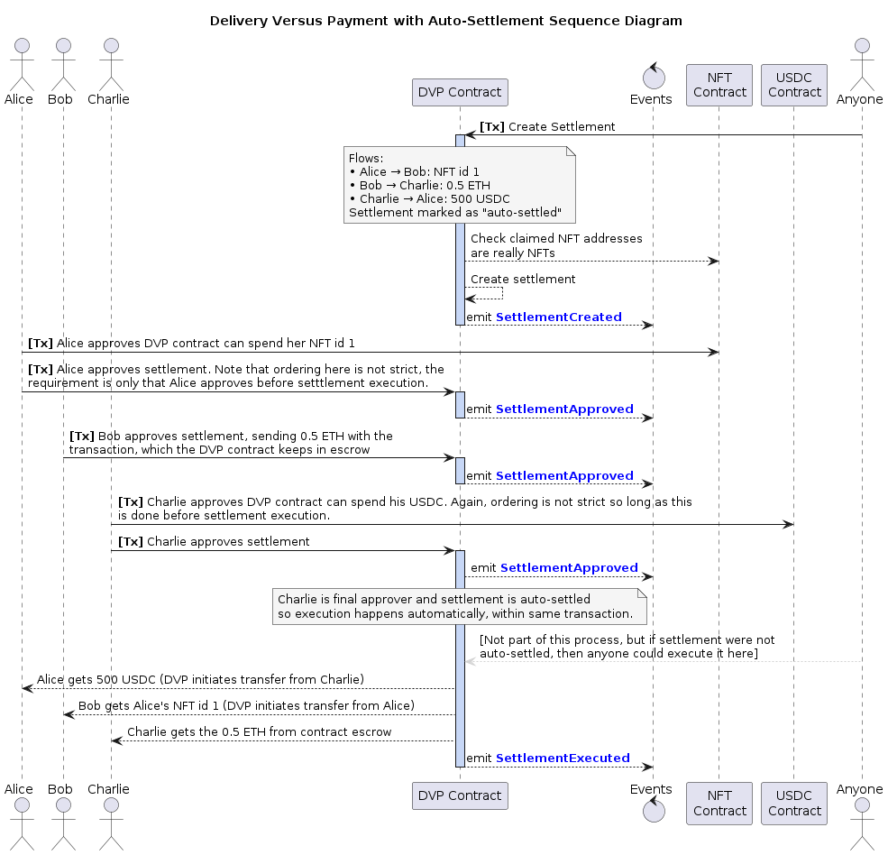

# Delivery Versus Payment <!-- omit from toc -->


- [Description](#description)
  - [Features](#features)
  - [Terminology](#terminology)
- [Installation](#installation)
- [Commands](#commands)
- [Deployed Addresses](#deployed-addresses)
- [Workflow Summary](#workflow-summary)
  - [Create a Settlement](#create-a-settlement)
  - [Approve a Settlement](#approve-a-settlement)
  - [Execute a Settlement](#execute-a-settlement)
  - [Changes](#changes)
  - [Gas Usage](#gas-usage)
  - [Griefing](#griefing)
- [Sequence Diagram](#sequence-diagram)
- [Contributing](#contributing)
- [Roadmap](#roadmap)
- [License](#license)

## Description
This repo is a permissionless implementation of the Delivery Versus Payment (DVP) protocol supporting ERC-20, ERC-721, and Ether transfers. Developed and actively used by [PV01](https://pv0.one), this project is open-sourced under the MIT [license](LICENSE) and provided as a public good.

### Features
 - Non-upgradeable, singleton [Delivery Versus Payment contract](contracts/dvp/V1/DeliveryVersusPaymentV1.sol).
 - Allows atomic swaps of an arbitrary number of assets between an arbitrary number of parties.
 - Permissionless, anyone can create and execute these swaps, so long as involved parties have approved.
 - Supports assets including native ETH, ERC-20 and ERC-721.
 - [Helper contract](contracts/dvp/V1/DeliveryVersusPaymentV1HelperV1.sol) provides search functionality for off-chain use.

### Terminology
 - Party: An address involved as either a `from` or `to` in an asset movement.
 - Flow: A movement of a single asset between two parties.
 - Asset: Ether, ERC-20 or ERC-721 token.
 - Settlement: A collection of an arbitrary number of flows, uniquely identified by a Settlement id. All settlements live in the singleton contract.

## Installation
Clone this repo, then:
```sh
yarn install
```

## Commands
The following CLI commands are available:
| # | Action          | Usage                            | Description                               |
|---|-----------------|----------------------------------|-------------------------------------------|
| 1 | Compile         | `yarn compile`                   | Compile Solidity smart contracts.         |
| 2 | Typechain       | `yarn typechain`                 | Generate TypeScript typings for contracts.|
| 3 | Test            | `yarn test`                      | Run smart contract tests.                 |
| 4 | Coverage        | `yarn coverage`                  | Run tests and generate coverage reports.  |
| 5 | Gas Estimate    | `yarn test:gas`                  | Run tests with detailed gas reporting.    |
| 6 | Sizer           | `yarn size`                      | Report contract sizes in bytes.           |
| 7 | Format          | `yarn format`                    | Auto-formats codebase.                    |

## Deployed Addresses
The DVP contracts are available at the following addresses. Since the solution is permissionless, they can be freely used as they are, without needing further contract deployments:
| Chain       | Instance    | Contract Etherscan Link          | Address                                      |
|-------------|-------------|----------------------------------|----------------------------------------------|
| Ethereum    | Mainnet     | DeliveryVersusPaymentV1          | `tbc`                                        |
| Ethereum    | Mainnet     | DeliveryVersusPaymentV1HelperV1  | `tbc`                                        |
| Ethereum    | Sepolia     | [DeliveryVersusPaymentV1](https://sepolia.etherscan.io/address/0x41F4330fe57b7B9DE77Afe9f4169BCBFFa1d9015)          | `0x41F4330fe57b7B9DE77Afe9f4169BCBFFa1d9015` |
| Ethereum    | Sepolia     | [DeliveryVersusPaymentV1HelperV1](https://sepolia.etherscan.io/address/0xf1173c7b079371762eEaeeafA47b9b8B53a50138)  | `0xf1173c7b079371762eEaeeafA47b9b8B53a50138` |

## Workflow Summary
### Create a Settlement
A settlement is collection of intended value transfers (Flows) between parties, along with a free text reference, a deadline (cutoff date) and an auto-settlement flag indicating if settlement should be immediately processed after final approval received. ERC-20, ERC-721 and Ether transfers are supported. For example a settlement could include the following 3 flows, be set to expire in 1 week, and be auto-settled when all `from` parties (sender addresses) have approved:

|  From    |    | To      | AmountOrId  | Token  | isNFT |
|----------|----|---------|-------------|--------|-------|
|  Alice   | -> | Bob     | 1           | ETH    | false |
|  Bob     | -> | Charlie | 400         | TokenA | false |
|  Charlie | -> | Alice   | 500(id)     | TokenB | true  |

- If a token claims to be an NFT and is not, the creation will revert.
- If a token claims to be an ERC20, but doesn't implement `decimals()`, the creation will revert.
- Anyone can create a settlement involving any parties and any asset.

### Approve a Settlement
Each party who is a `from` address in one or more flows needs to approve the settlement before it can proceed. They do this by calling `approveSettlements()` and including their necessary total ETH deposit if their flows involve sending ETH. ERC-20 and ERC-721 tokens are not deposited upfront, they only need transfer approval before execution. If a settlement is marked as `isAutoSettled`:
 - the settlement will be executed automatically after all approvals are in place, the gas cost being borne by the last approver.
 - if settlement approval succeeds, but auto-execution fails, the entire transaction is not reverted. The approval remains on-chain, only the settlement execution is reverted.

### Execute a Settlement
Anyone can call `executeSettlement()` before the cutoff date, if all approvals are in place. At execution time the contract makes the transfers in an atomic, all or nothing, manner. If any Flow transfer fails the entire settlement is reverted.

### Changes
If a party changes their mind before the settlement is fully executed — and before the cutoff date — they can revoke their approval by calling `revokeApprovals()`. This returns any deposited ETH back to them and removes their approval. Once expired a settlement can no longer be executed, any ETH deposited can be withdrawn by each party using `withdrawETH()`.

### Gas Usage
There are many unbounded loops in this contract, by design. There is no limit on the number of flows in a settlement, nor on how many settlements can be batch processed (for functions that receive an array of settlementIds). The current chain's block gas limit acts as a cap. In every case it is the caller's responsibility to ensure that the gas requirement can be met.

### Griefing
It is acknowledged that bad actors could be annoying by creating flows with fake tokens, or flows with tokens that would intentionally revert when the settlement is executed, and so making a settlement impossible to process. These bad actors could potentially trick other parties into locking ETH into a settlement that could never be processed. There is no financial loss (gas fees excepted) because when other parties discover the ruse, they can withdraw their approval and withdraw their ETH.

## Sequence Diagram
Sequence diagram for a happy path process though a settlement with auto-settle enabled.


## Events
Topic0 values for events are:
| Event                                  | topic0                                                             |
|----------------------------------------|--------------------------------------------------------------------|
| ETHReceived                            | 0xbfe611b001dfcd411432f7bf0d79b82b4b2ee81511edac123a3403c357fb972a |
| ETHWithdrawn                           | 0x94b2de810873337ed265c5f8cf98c9cffefa06b8607f9a2f1fbaebdfbcfbef1c |
| SettlementApprovalRevoked              | 0x96c5a579760c144ad93a5c19d41440d5185ba0451704c0ac7cb22488d8735ac2 |
| SettlementApproved                     | 0x7f89b61c53062fb158619c7b66552eabdfb0e1d37c439a62c2d2b5a657bcea93 |
| SettlementAutoExecutionFailedOther     | 0x63c222ac809d589e48426985c6af11739f936b405e0a78a920fbae6565c07497 |
| SettlementAutoExecutionFailedPanic     | 0x3ad9899b9bd85d1d9b8ab792041d08fe646b2d286885240f5baa3cbc1d721270 |
| SettlementAutoExecutionFailedReason    | 0xe1c01819733d746479549271d3a51445514b8f678614d50ad34d305c67b83d9c |
| SettlementCreated                      | 0x3c521c92800f95c83d088ee8c520c5b47b3676958e48a985fe1d45d7cf6dbd78 |
| SettlementExecuted                     | 0xf059ff22963b773739a912cc5c0f2f358be1a072c66ba18e2c31e503fd012195 |

## Contributing
See [CONTRIBUTING.md](CONTRIBUTING.md) for more details.

## Roadmap
See [ROADMAP.md](ROADMAP.md) for more details.

## License
This project is licensed under the terms of the [LICENSE](LICENSE).

