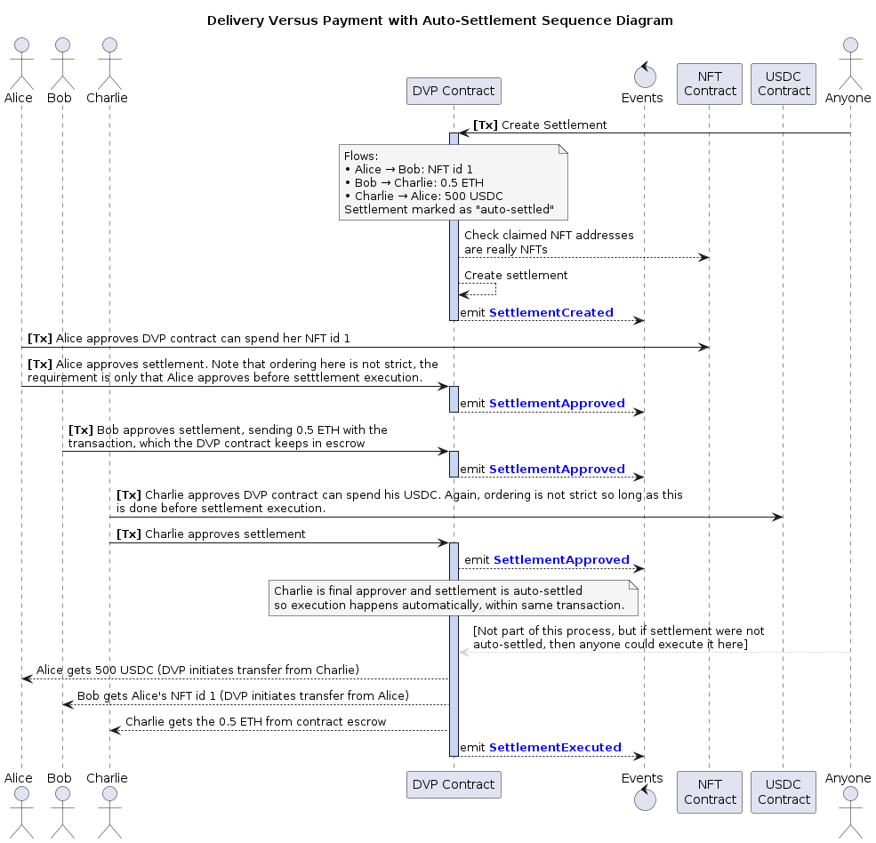

# Delivery Versus Payment <!-- omit from toc -->


[](https://deepwiki.com/PV01-org/delivery-versus-payment)

- [Description](#description)
  - [Features](#features)
  - [Terminology](#terminology)
- [Installation](#installation)
- [Commands](#commands)
- [Deployed Addresses](#deployed-addresses)
  - [Further Deployments](#further-deployments)
- [Workflow Summary](#workflow-summary)
  - [Create a Settlement](#create-a-settlement)
  - [Approve a Settlement](#approve-a-settlement)
  - [Execute a Settlement](#execute-a-settlement)
  - [Changes](#changes)
  - [Gas Usage](#gas-usage)
  - [Griefing](#griefing)
  - [Reentrancy Protection](#reentrancy-protection)
- [Sequence Diagram](#sequence-diagram)
- [Events](#events)
- [Contributing](#contributing)
- [Roadmap](#roadmap)
- [License](#license)

## Description
This repo is a permissionless implementation of the Delivery Versus Payment (DVP) protocol supporting ERC-20, ERC-721, and Ether transfers. Developed and actively used by [PV01](https://pv0.one), this project is open-sourced under the MIT [license](LICENSE) and provided as a public good.

### Features
 - Non-upgradeable, singleton [Delivery Versus Payment contract](contracts/dvp/V1/DeliveryVersusPaymentV1.sol).
 - Allows atomic swaps of an arbitrary number of assets between an arbitrary number of parties.
 - Permissionless, anyone can create and execute these swaps, so long as involved parties have approved.
 - Supports assets including native ETH, ERC-20 and ERC-721.
 - [Helper contract](contracts/dvp/V1/DeliveryVersusPaymentV1HelperV1.sol) provides search functionality for off-chain use.

### Terminology
 - Party: An address involved as either a `from` or `to` in an asset movement.
 - Flow: A movement of a single asset between two parties.
 - Asset: Ether, ERC-20 or ERC-721 token.
 - Settlement: A collection of an arbitrary number of flows, uniquely identified by a Settlement id. All settlements live in the singleton contract.

## Installation
```
git clone --recurse-submodules https://github.com/PV01-org/delivery-versus-payment.git
cd delivery-versus-payment
forge build
```

## Commands
The following CLI commands are available:
| # | Action         | Usage                         | Description                               |
|---|----------------|-------------------------------|-------------------------------------------|
| 1 | Compile        | `forge build`                 | Compile Solidity smart contracts.         |
| 2 | Test           | `forge test --summary`        | Run smart contract tests.                 |
| 3 | Coverage       | `forge coverage --ir-minimum` | Run tests and generate coverage reports.  |
| 4 | Gas Estimate   | `forge test --gas-report`     | Run tests with gas reporting.             |
| 5 | Sizer          | `forge build --sizes`         | Report contract size.                     |

## Deployed Addresses
The DVP contracts are available at the following addresses. Since the solution is permissionless, they can be freely used as they are, without needing further contract deployments. To deploy new contracts see [Further Deployments](#further-deployments).
| Chain       | Instance          | Contract Block Explorer Link     | Address                                      |
|-------------|-------------------|----------------------------------|----------------------------------------------|
| Arbitrum    | Testnet (Sepolia) | [DeliveryVersusPaymentV1](https://sepolia.arbiscan.io/address/0xb4bfeA02E82172E8A12F8AA41B5F729B4778F33F)          | `0xb4bfeA02E82172E8A12F8AA41B5F729B4778F33F` |
| Arbitrum    | Testnet (Sepolia) | [DeliveryVersusPaymentV1HelperV1](https://sepolia.arbiscan.io/address/0x700A55267Dad74763b4B5f0C0B727B6a86DD58D3)  | `0x700A55267Dad74763b4B5f0C0B727B6a86DD58D3` |
| Avalanche   | Mainnet           | [DeliveryVersusPaymentV1](https://snowtrace.io/address/0xF38a32671795Ffb2dFC7791DC10423b526679929)          | `0xF38a32671795Ffb2dFC7791DC10423b526679929` |
| Avalanche   | Mainnet           | [DeliveryVersusPaymentV1HelperV1](https://snowtrace.io/address/0x6297259fB38F4871DF74C510919CF2F7F7831A49)  | `0x6297259fB38F4871DF74C510919CF2F7F7831A49` |
| Avalanche   | Testnet (Fuji)    | [DeliveryVersusPaymentV1](https://testnet.snowtrace.io/address/0xfDD3D731AFb3a1c4eFe18AedF750abBf2189BF9d)          | `0xfDD3D731AFb3a1c4eFe18AedF750abBf2189BF9d` |
| Avalanche   | Testnet (Fuji)    | [DeliveryVersusPaymentV1HelperV1](https://testnet.snowtrace.io/address/0x82aF9b22399693b7cFb4b5d827D29d7B0b52F120)  | `0x82aF9b22399693b7cFb4b5d827D29d7B0b52F120` |
| Ethereum    | Mainnet           | [DeliveryVersusPaymentV1](https://etherscan.io/address/0x94D01960C2F09502a64ae83547da0828fd3fF4e3)             | `0x94D01960C2F09502a64ae83547da0828fd3fF4e3` |
| Ethereum    | Mainnet           | [DeliveryVersusPaymentV1HelperV1](https://etherscan.io/address/0xE1e2e50918Bf18207eE87B7618888128d19D8a44) |`0xE1e2e50918Bf18207eE87B7618888128d19D8a44` |
| Ethereum    | Testnet (Sepolia) | [DeliveryVersusPaymentV1](https://sepolia.etherscan.io/address/0x2A208C4a5b94A6a8E1546e892832F76a9313741b)          | `0x2A208C4a5b94A6a8E1546e892832F76a9313741b` |
| Ethereum    | Testnet (Sepolia) | [DeliveryVersusPaymentV1HelperV1](https://sepolia.etherscan.io/address/0x53953083AC1Ad08202398951C77447F9d95B5c98)  | `0x53953083AC1Ad08202398951C77447F9d95B5c98` |
| Polygon     | Mainnet           | [DeliveryVersusPaymentV1](https://polygonscan.com/address/0x8275709ca99574b676aDd48C32a9969017E5c69C)          | `0x8275709ca99574b676aDd48C32a9969017E5c69C` |
| Polygon     | Mainnet           | [DeliveryVersusPaymentV1HelperV1](https://polygonscan.com/address/0x5aA9B6D1F6a37F20D90DCA99f0a78c6ab8e9bD4E)  | `0x5aA9B6D1F6a37F20D90DCA99f0a78c6ab8e9bD4E` |

## Further Deployments
### Deploying Individual Contracts
To deploy further copies of individual contracts, with code verification, use the deploy scripts in the `./script` folder. For example, without requiring any `.env` file:

```bash
forge script script/DeployDvp.s.sol \
  --rpc-url <RPC_URL> \
  --private-key <PRIVATE_KEY> \
  --verify --etherscan-api-key <ETHERSCAN_API_KEY> \
  --broadcast
```

### Deploying Contracts to Many Chains
To deploy the DVP contract and the DVP helper contract with code verification, on many chains, follow these steps:
1. In the `env` file (copy from `.env.template` if this does not exist) maintain values for all the environment variables listed.
2. See the help for this script to see supported chains:
```bash
$ scripts/deploy-multi-chain.sh -h
```
3. Run:
```bash
./scripts/deploy-multi-chain.sh
```
which deploys to all chains supported by the script, or run:
```bash
./scripts/deploy-multi-chain.sh -n sepolia arbsepolia
```
to deploy just to some of the supported chains.

### Deploying Contracts to Many New Chains
The list of chains to deploy to in the previous section can be extended by following these steps:
1. Define the network names to deploy to in `foundry.toml`. You can see the existing network names in `foundry.toml` with their RPC URL under `[rpc_endpoints]` and their verification API key under `[etherscan]`.
2. Edit `.env` and maintain the environment variables you asked for in `foundry.toml` in step 1.
3. Edit the deploy script `deploy-multi-chain.sh` in the `.scripts` folder. Change the variable called `NETWORKS` to contain the additional network names you want to deploy to.
4. Run:
```bash
./scripts/deploy-multi-chain.sh -n <new network name>
```
to deploy all contracts with code verification to the new chain.

## Workflow Summary
### Create a Settlement
A settlement is collection of intended value transfers (Flows) between parties, along with a free text reference, a deadline (cutoff date) and an auto-settlement flag indicating if settlement should be immediately processed after final approval received. ERC-20, ERC-721 and Ether transfers are supported. For example a settlement could include the following 3 flows, be set to expire in 1 week, and be auto-settled when all `from` parties (sender addresses) have approved:

|  From    |    | To      | AmountOrId  | Token  | isNFT |
|----------|----|---------|-------------|--------|-------|
|  Alice   | -> | Bob     | 1           | ETH    | false |
|  Bob     | -> | Charlie | 400         | TokenA | false |
|  Charlie | -> | Alice   | 500(id)     | TokenB | true  |

- If a token claims to be an NFT and is not, the creation will revert.
- If a token claims to be an ERC20, but doesn't implement `decimals()`, the creation will revert.
- Anyone can create a settlement involving any parties and any asset.

### Approve a Settlement
Each party who is a `from` address in one or more flows needs to approve the settlement before it can proceed. They do this by calling `approveSettlements()` and including their necessary total ETH deposit if their flows involve sending ETH. ERC-20 and ERC-721 tokens are not deposited upfront, they only need transfer approval before execution. If a settlement is marked as `isAutoSettled`:
 - the settlement will be executed automatically after all approvals are in place, the gas cost being borne by the last approver.
 - if settlement approval succeeds, but auto-execution fails, the entire transaction is not reverted. The approval remains on-chain, only the settlement execution is reverted.

### Execute a Settlement
Anyone can call `executeSettlement()` before the cutoff date, if all approvals are in place. At execution time the contract makes the transfers in an atomic, all or nothing, manner. If any Flow transfer fails the entire settlement is reverted.

### Changes
If a party changes their mind before the settlement is fully executed — and before the cutoff date — they can revoke their approval by calling `revokeApprovals()`. This returns any deposited ETH back to them and removes their approval. Once expired a settlement can no longer be executed, any ETH deposited can be withdrawn by each party using `withdrawETH()`.

### Gas Usage
There are many unbounded loops in this contract, by design. There is no limit on the number of flows in a settlement, nor on how many settlements can be batch processed (for functions that receive an array of settlementIds). The current chain's block gas limit acts as a cap. In every case it is the caller's responsibility to ensure that the gas requirement can be met.

### Griefing
It is acknowledged that bad actors could be annoying by creating flows with fake tokens, or flows with tokens that would intentionally revert when the settlement is executed, and so making a settlement impossible to process. These bad actors could potentially trick other parties into locking ETH into a settlement that could never be processed. There is no financial loss (gas fees excepted) because when other parties discover the ruse, they can withdraw their approval and withdraw their ETH.

### Reentrancy Protection
Settlement approval can be done in batches. Settlement execution can potentially be triggered inside that (if auto-settle is switched on and a party is giving the final approval). Settlement execution can make many external calls to process transfers of assets. These patterns lend themselves well to reentrancy, which is protected against as follows:

| Function             | Reentrancy Protection     |
|----------------------|---------------------------|
| approveSettlements() | OZ nonReentrant modifer   |
| createSettlement()   | No external calls made    |
| executeSettlement()  | OZ nonReentrant modifer   |
| revokeApprovals()    | OZ nonReentrant modifer   |
| withdrawETH()        | OZ nonReentrant modifer   |

There are some subtleties inside the protection for `approveSettlements()` and `executeSettlement()`, explained [here](REENTRANCY.md).

## Sequence Diagram
Sequence diagram for a happy path process though a settlement with auto-settle enabled.


## Events
Topic0 values for events are:

| Event                                                        | Topic0                                                             |
|--------------------------------------------------------------|--------------------------------------------------------------------|
| ETHReceived(address,uint256)                                 | 0xbfe611b001dfcd411432f7bf0d79b82b4b2ee81511edac123a3403c357fb972a |
| ETHWithdrawn(address,uint256)                                | 0x94b2de810873337ed265c5f8cf98c9cffefa06b8607f9a2f1fbaebdfbcfbef1c |
| SettlementApprovalRevoked(uint256,address)                   | 0x96c5a579760c144ad93a5c19d41440d5185ba0451704c0ac7cb22488d8735ac2 |
| SettlementApproved(uint256,address)                          | 0x7f89b61c53062fb158619c7b66552eabdfb0e1d37c439a62c2d2b5a657bcea93 |
| SettlementCreated(uint256,address)                           | 0x3c521c92800f95c83d088ee8c520c5b47b3676958e48a985fe1d45d7cf6dbd78 |
| SettlementExecuted(uint256,address)                          | 0xf059ff22963b773739a912cc5c0f2f358be1a072c66ba18e2c31e503fd012195 |
| SettlementExecutionFailedOther(uint256,address,bool,bytes)   | 0x2fb0f0e288825d79bc923ab286ce365c1552f8776aa33413af9a35b5ae6028c5 |
| SettlementExecutionFailedPanic(uint256,address,bool,uint256) | 0xe8371a49f37ebac2050c0e5b70c4ee88e0776c5ba7e3be09e1b9660fefa3528a |
| SettlementExecutionFailedReason(uint256,address,bool,string) | 0x55e0c9c38879d7b337ccd4db63235e0c504f645e3f925a790a1496ac7d090174 |

## Linting and pre-commit
This repository uses pre-commit to run lightweight checks and enforce a standard Solidity code format via Foundry.

Setup (one-time):
- Install pre-commit (choose one):
  - pipx: `pipx install pre-commit`
  - pip: `pip install --user pre-commit`
  - Homebrew (macOS): `brew install pre-commit`
- Ensure Foundry is installed and available in your PATH: https://book.getfoundry.sh/getting-started/installation
- Enable hooks in this repo: `pre-commit install`

Usage:
- Run on all files: `pre-commit run --all-files`
- On commit, hooks will run automatically.
- The Solidity formatter runs in check mode (`forge fmt --check`). If formatting fails, fix with: `forge fmt`

Formatting standard:
- Uses Foundry's standard formatter configured in `foundry.toml` under `[fmt]` (e.g., `line_length = 120`, `tab_width = 2`).

## Contributing
See [CONTRIBUTING.md](CONTRIBUTING.md) for more details.

## Roadmap
See [ROADMAP.md](ROADMAP.md) for more details.

## License
This project is licensed under the terms of the [LICENSE](LICENSE).
